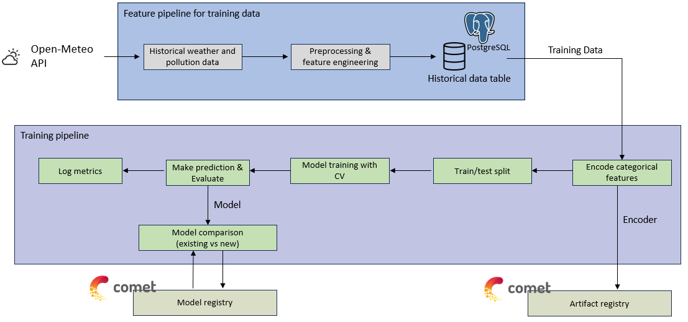
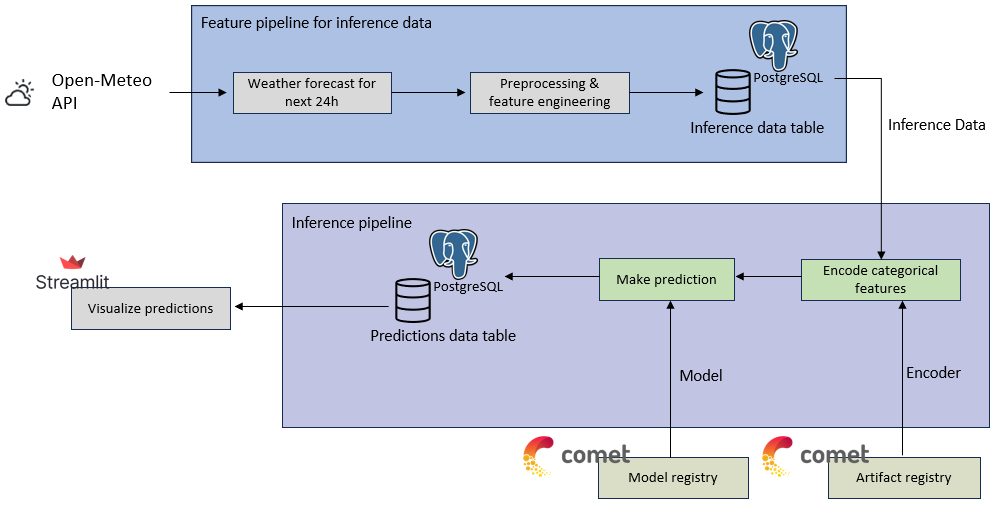

# Particle pollution from fine particulates (PM2.5) estimation for European Union capitals
This project is a web application that estimates the particle pollution from fine particulates (PM2.5) using the weather forecast data.
The estimation is done utilizing a machine learning model that is trained on the historical weather and PM2.5 data from [Open-Meteo](https://open-meteo.com/) API.

The application is built using [CometML](https://www.comet.com/site/) machine learning platform for model registry and tracking,
[ElephantSQL (PostgreSQL)](https://www.elephantsql.com/) database for data storage, and streamlit for visualizing the estimations.
Github Actions is used to run the workflows for the model training and deployment on batch processing with schedule.

The app can be accessed at website: https://eu-airqualityestimation.streamlit.app/

**PS: This app has been developed to demonstrate how to build a machine learning pipeline for free using the above-mentioned tools. 
The model used in the app is a simple regression model and is not optimized for the best performance.**

## Pipeline Construction

### 1. Training pipeline
Training pipeline is constructed using Github Actions. 
The pipeline is triggered by a schedule (11 PM on the 1st day of every month). 
The pipeline steps are shown in the following diagram:

### 2. Inference pipeline
Inference pipeline is constructed using Github Actions as well. 
The pipeline is triggered by a schedule (at midnight every day). 
The pipeline steps are shown in the following diagram:

